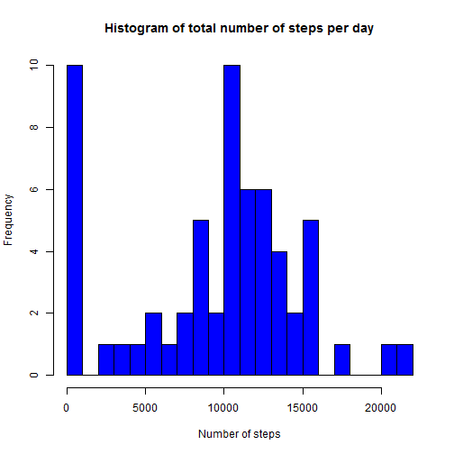
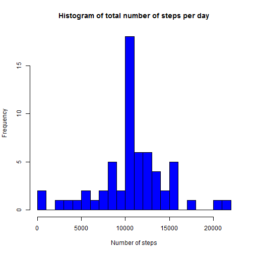
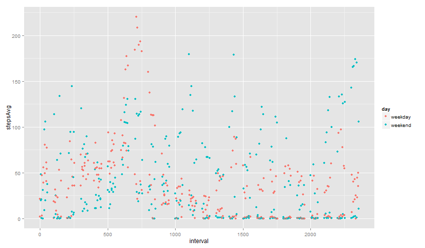

# Reproducible Research: Peer Assessment 1


## Loading and preprocessing the data

The data is located inside a compressed file "activity.zip". The first task is to open a connection with the file in order to access the compressed data and read this data into an R data frame.


```r
fname <- "activity.zip"
con <- unz(fname, "activity.csv")
data <- read.csv(con, colClasses = c("numeric", "character", "character"))
unlink(con)
```


After loading the data we transform the interval column into a factor and the date column into R dates objects. This is the best option to perform subsequent analyses.


```r
data$interval <- as.factor(data$interval)
data$date <- as.Date(data$date)
```


## What is mean total number of steps taken per day?

In order to calculate the mean number of steps per day we will first create a new data frame with the total number of steps per day


```r
library(reshape2)
mdata <- melt(data, id = c("interval", "date"))
totalSteps <- dcast(mdata, date ~ variable, sum, na.rm = T)
```


It is important to note that the missing values are deleted in order to perform the calculations.

Histogram of the total number of steps taken per day.


```r
hist(totalSteps$steps, breaks = 20, col = "blue", main = "Histogram of total number of steps per day", 
    xlab = "Number of steps")
```

 


The following code calculates the mean and median of the total number of steps per day.


```r
mean <- round(mean(totalSteps$steps), 2)
median <- median(totalSteps$steps)
```

The average number of steps taken per day is 9354.23 and the median number of steps is 1.0395 &times; 10<sup>4</sup>.


## What is the average daily activity pattern?

This code calculates the average number of steps per interval accross all days and shows a time series plot of the results


```r
avStepsPerInterval <- tapply(data$steps, data$interval, mean, na.rm = T)
avStepsPerInterval <- data.frame(steps = avStepsPerInterval, interval = as.integer(levels(data$interval)))
avStepsPerInterval <- avStepsPerInterval[order(avStepsPerInterval$interval), 
    ]
with(avStepsPerInterval, {
    plot(interval, steps, type = "l")
})
```

 


We need to calculate the interval with the maximum number of steps on average an generate the adequate string.


```r
maxInterval <- with(avStepsPerInterval, {
    interval[which.max(steps)]
})
maxInterval <- sprintf("%02d:%02d", maxInterval%/%100, maxInterval%%100)
```


The 5-minute interval with the maximum number of step on average starts at 08:35.


## Imputing missing values

Computing the total number of missing values.


```r
missing <- sum(is.na(data$steps))
```


The number of missing values is 2304.

The strategy to fill the missing values is to include the average for that 5-minute span.


```r
filledData <- data
temp <- filledData[is.na(data$steps), ]$interval
temp <- match(as.numeric(levels(temp))[temp], avStepsPerInterval$interval)
filledData[is.na(data$steps), ]$steps <- avStepsPerInterval[temp, ]$steps
```


Calculate a histogram of the total number of steps taken each day.

```r
mdata2 <- melt(filledData, id = c("interval", "date"))
totalSteps2 <- dcast(mdata2, date ~ variable, sum, na.rm = T)
hist(totalSteps2$steps, breaks = 20, col = "blue", main = "Histogram of total number of steps per day", 
    xlab = "Number of steps")
```

 


The following code calculates the mean and median of the total number of steps per day.


```r
mean <- round(mean(totalSteps2$steps), 2)
median <- median(totalSteps2$steps)
```

The average number of steps taken per day is 1.0766 &times; 10<sup>4</sup> and the median number of steps is 1.0766 &times; 10<sup>4</sup>.


## Are there differences in activity patterns between weekdays and weekends?

First we create a factor variable to indicate whether a given date is a weekday or weekend day.


```r
temp <- weekdays(filledData$date) %in% c("sabado", "domingo")
filledData$weekday <- ifelse(temp, "weekend", "weekday")
filledData <- transform(filledData, weekday = as.factor(weekday))
```


Afterwards, we average accross all intervals taking into account if it is a weekday or weekend and plot the results.


```r
weekdayAvg <- with(filledData, {
    aggregate(steps, list(weekday, interval), mean)
})
names(weekdayAvg) <- c("day", "interval", "stepsAvg")
weekdayAvg <- transform(weekdayAvg, interval = as.integer(levels(data$interval)))
weekdayAvg <- weekdayAvg[order(weekdayAvg$interval), ]
library(ggplot2)
qplot(interval, stepsAvg, data = weekdayAvg, color = day)
```

 


We can observe that during weekdays there is more activity about the interval 600 which is consistent with the fact that during weekdays people must go to work. Meanwhile, during the day there appears to be more activity during weekends because people are not usually at work.
